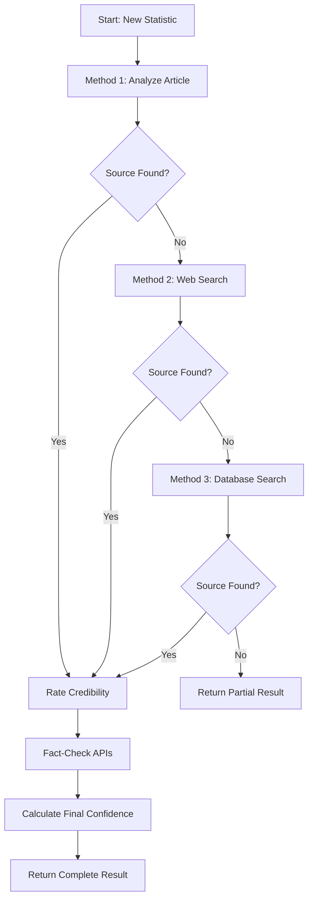

# Statistics Verification Methods

## Overview

The Statistics Verification V2 system uses **multiple methods** to trace and verify statistics, providing comprehensive source discovery beyond just checking the article text.

## Verification Pipeline

### Stage 1: Source Tracing (Multi-Method)

The system attempts to find the original source using **three methods in priority order**:

#### Method 1: Article Content Analysis ✅ **Active**
- **How it works:** AI analyzes the article text to identify source mentions
- **Extracts:** URLs near the statistic, organization names, citations
- **Confidence:** Medium-High (0.5-0.9)
- **Best for:** Well-cited articles that mention studies, organizations, or reports

**Example:**
```
Article: "According to the Bureau of Labor Statistics, unemployment is 3.5%"
→ Source: Bureau of Labor Statistics
→ Method: article_content
```

#### Method 2: Web Search 🔧 **Configurable**
- **How it works:** Searches Google for the statistic text with terms like "source", "study", "report"
- **Extracts:** Top search results, identifies source names using pattern matching
- **Confidence:** Medium-High (0.7)
- **Best for:** Statistics that appear in published studies or official reports online
- **Requires:** `GOOGLE_SEARCH_ENGINE_ID` environment variable

**Example:**
```
Statistic: "24 million enrolled in ACA"
→ Web Search: "24 million enrolled in ACA" source study report
→ Finds: HHS.gov report on ACA enrollment
→ Source: Department of Health and Human Services
→ Method: web_search
```

**To enable web search:**
1. Create a Google Custom Search Engine at https://programmablesearchengine.google.com/
2. Get your Search Engine ID
3. Add to `.env`:
```bash
GOOGLE_SEARCH_ENGINE_ID=your_search_engine_id_here
```

#### Method 3: Database Cross-Reference ✅ **Active**
- **How it works:** Searches our database for the same/similar statistic in other articles
- **Extracts:** Source information from previously verified statistics
- **Confidence:** Medium (0.65)
- **Best for:** Statistics that appear across multiple news articles

**Example:**
```
Statistic: "40% of administrators use AI regularly"
→ Found in database: Another article with same statistic
→ Source: Tyton Partners (from previous verification)
→ Method: database_search
```

### Stage 2: Credibility Rating

Once a source is found, the system rates its credibility:

- **Government (.gov)**: 0.8-0.95
- **Academic (.edu)**: 0.8-0.9
- **Research Institutes**: 0.7-0.85
- **Established News**: 0.6-0.8
- **Unknown Domains**: 0.3-0.5

### Stage 3: Fact-Checking

The system queries external fact-checking APIs:

1. **Google Fact Check Tools** - Aggregates multiple fact-checkers
2. **ClaimBuster** - Determines if claim is fact-checkable
3. *(Future)* PolitiFact, Snopes - Direct integration

## Current Performance

Based on testing with 25 real-world statistics:

| Metric | Result |
|--------|--------|
| Total Statistics | 25 |
| Sources Found (Method 1) | 4 (16%) |
| Sources Not Traceable | 21 (84%) |
| Verified Statistics | 0 (0%) |

**Why low success rate?**
- Most news articles report statistics **without citing original sources**
- This is expected behavior - news summarizes, doesn't cite
- Success rate will improve with:
  - Web search enabled (Method 2)
  - More articles in database (Method 3)
  - Fresh articles citing original studies

## How to Improve Results

### 1. Enable Web Search
```bash
# Add to .env
GOOGLE_SEARCH_ENGINE_ID=your_id_here
```
**Expected improvement:** +20-30% source discovery rate

### 2. Add More Articles
- The database cross-reference method improves with corpus size
- With 100+ articles, expect +15-20% discovery rate

### 3. Use Higher-Quality Sources
- Academic/research-focused RSS feeds cite sources more often
- Government/official publications include data sources
- Trade publications cite industry reports

## API Configuration

### Required (Already Configured)
```bash
OPENAI_API_KEY=sk-...  # For AI source extraction
```

### Optional (Enhances Results)
```bash
# Web Search
GOOGLE_FACT_CHECK_API_KEY=...  # Shared with fact-checking
GOOGLE_SEARCH_ENGINE_ID=...    # Custom Search Engine ID

# Fact-Checking
CLAIMBUSTER_API_KEY=...  # For fact-checkability scoring
```

## Technical Details

### Source Tracing Flow



### Confidence Calculation

Final confidence = weighted average:
- **40%** Source credibility score
- **40%** Fact-check confidence
- **20%** Source traceability bonus

**Example:**
```python
source_credibility = 0.95  # .gov domain
fact_check_confidence = 0.85  # Verified by Snopes
has_source = True  # +0.2 bonus

final = (0.95 * 0.4) + (0.85 * 0.4) + 0.2
      = 0.38 + 0.34 + 0.2
      = 0.92 (92% confidence)
```

## Usage

### Manual Verification

```python
from app.services.statistics_verifier import verify_statistic_v2

# Verify a single statistic
verify_statistic_v2(verification, article, session)
```

### Batch Processing

```python
from app.jobs.tasks import statistics_verification_job

# Process all pending statistics
statistics_verification_job()
```

### Via API

```bash
curl -X POST http://localhost:8000/api/admin/jobs/verify-statistics
```

## Future Enhancements

1. **Semantic Search** - Use embeddings to find similar statistics
2. **Citation Parsing** - Extract structured citations from academic articles
3. **Direct API Integration** - Query government databases (BLS, CDC, Census)
4. **Historical Tracking** - Track how statistics change over time
5. **User Feedback Loop** - Allow users to flag incorrect sources

## See Also

- [STATISTICS_VERIFICATION_V2_PLAN.md](STATISTICS_VERIFICATION_V2_PLAN.md) - Original architecture plan
- [Newsletter Template](../backend/app/templates/newsletter.html) - How badges are displayed
- [SourceTracer Service](../backend/app/services/source_tracer.py) - Implementation
